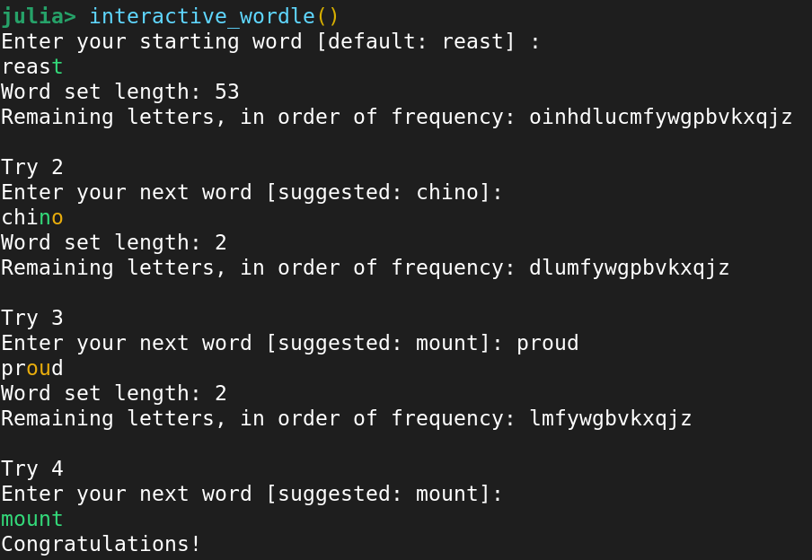

# Wordle solver, based on https://perfectionatic.org/?p=753

After I read the excellent blog post by perfectionatic, I had the idea to try to come up with a smart strategy for picking the next wordle word.
I noticed that when I play wordle, I try to pick words with common English letters that haven't appeared yet.
So that's what the "smart strategy" does, just ranks all words in the wordlist by how common of letters they have.
The suggested word in the prompt is precisely this one. This strategy improves on a random strategy by about `0.4` guesses per word on average, which is honestly less than I was expecting.


To use, just

```julia
julia> include("wordle_solver.jl")
```

## Cheating at wordle
To help with playing a wordle game, run `wordle_cheater()`. To accept the suggestion, just hit enter, or type your own word if you'd like to try something else.
There's no checking that the words are valid, or that you only enter 0,1,2 in the wordle response section.

```julia
julia> wordle_cheater()
Enter your starting word [default: reast] :
Enter your response (Gray,Yellow,Green -> 0,1,2): 02010
Word set length: 107
Remaining letters, in order of frequency: oinhdlucmfywgpbvkxqjz
Enter your next word [suggested: chino]: 
Enter your response (Gray,Yellow,Green -> 0,1,2): 00110
Word set length: 1
Remaining letters, in order of frequency: dlumfywgpbvkxqjz
Enter your next word [suggested: penis]: 
```

## Playing wordle on your own
I also included a self-contained implementation of wordle, for when you want to procrastinate for more than one wordle game in a row.
The suggestions are left on, and there is no protection against entering words that aren't in the wordlist.
The answer words are all from real wordles during 2022, so you may already know them.



## Ranking wordle strategies

There's no point in trying weird strategies if you can't rank them.
This function essentially plays wordle using the strategy's suggested words until it wins, and returns how many guesses it took.
By default, it runs over the entire wordlist, even words that have never appeared in a wordle.
Some of these have one or two double-letters, which prove pretty difficult for either a random or a letter-frequency-ranking strategy (worst case: 12 guesses!).

```julia
julia> count_rand = rank_wordle_strategy(:random)
100.0%┣███████████████████████████████████████████████████████████████████████████████████████████████████████████████████████████████████████████████████████┫ 5.8k/5.8k [00:40<00:00, 256it/s]
5757-element Vector{Float64}:
 5.0
 5.0
 5.0
 5.0
 4.0
 4.0
 3.0
 4.0
 5.0
 4.0
 6.0
 6.0
 6.0
 6.0
 4.0
 7.0
 5.0
 5.0
 6.0
 6.0
 4.0
 6.0
 4.0
 ⋮
 6.0
 4.0
 6.0
 5.0
 4.0
 5.0
 6.0
 6.0
 7.0
 5.0
 5.0
 6.0
 6.0
 4.0
 5.0
 7.0
 5.0
 4.0
 5.0
 5.0
 6.0
 5.0
julia> count_letter = rank_wordle_strategy(:letter_freq)
100.0%┣███████████████████████████████████████████████████████████████████████████████████████████████████████████████████████████████████████████████████████┫ 5.8k/5.8k [01:10<00:00, 83it/s]
5757-element Vector{Float64}:
 5.0
 5.0
 5.0
 5.0
 4.0
 4.0
 3.0
 4.0
 5.0
 4.0
 6.0
 6.0
 6.0
 6.0
 4.0
 7.0
 5.0
 5.0
 6.0
 6.0
 4.0
 6.0
 4.0
 ⋮
 6.0
 4.0
 6.0
 5.0
 4.0
 5.0
 6.0
 6.0
 7.0
 5.0
 5.0
 6.0
 6.0
 4.0
 5.0
 7.0
 5.0
 4.0
 5.0
 5.0
 6.0
 5.0
julia> using Statistics
julia> mean.([count_letter,count_rand])
2-element Vector{Float64}:
 5.284523189161021
 5.669445891957617
```
